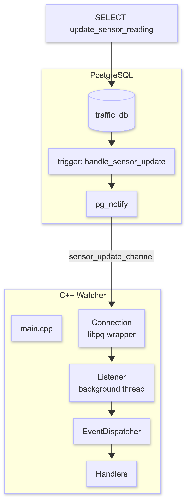
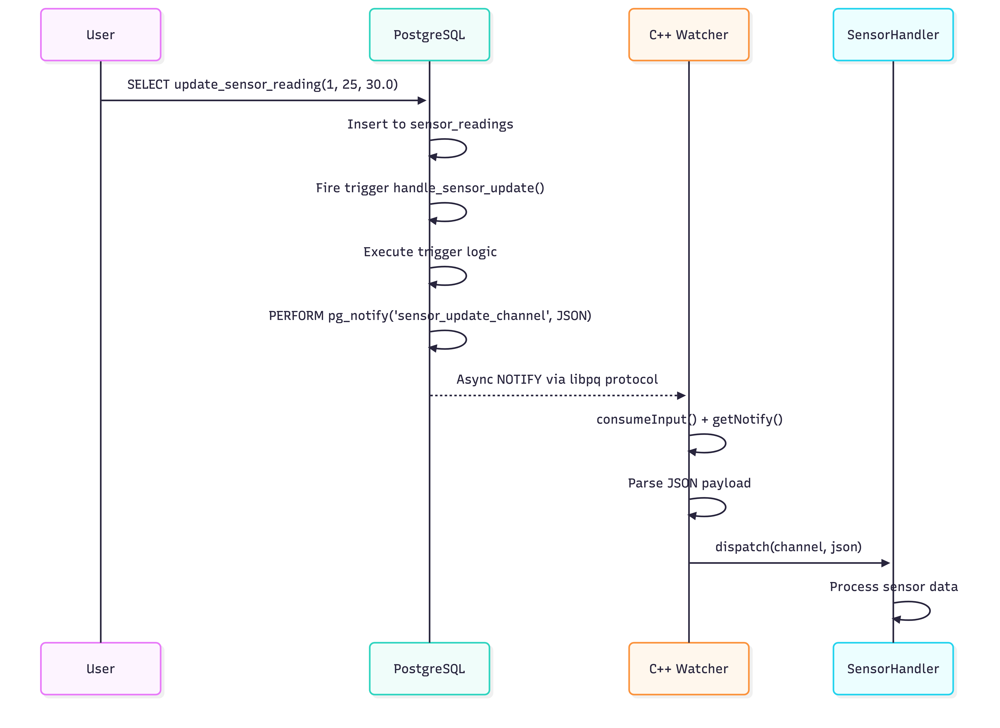
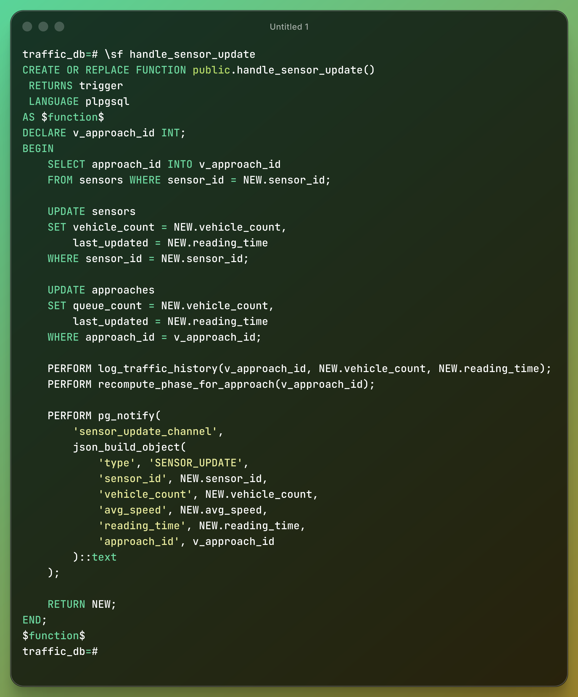
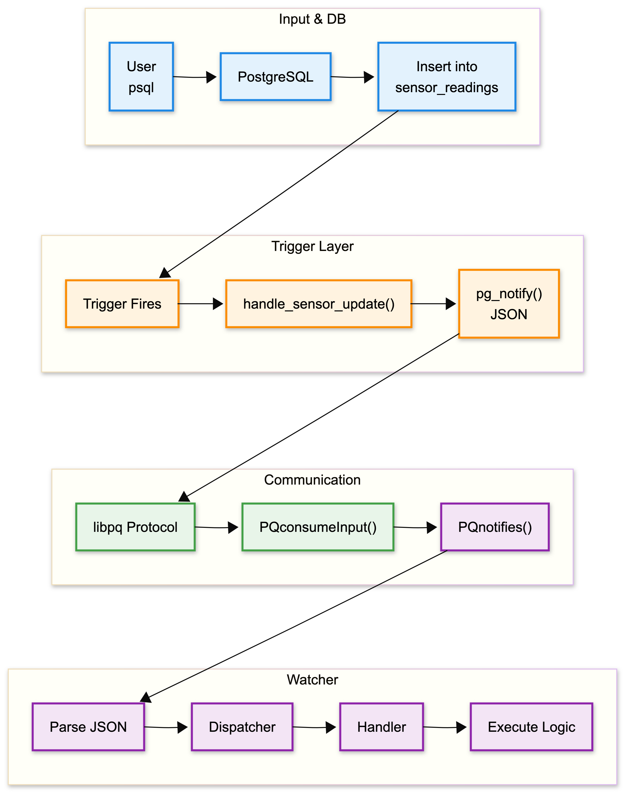

# SQL Watcher - Architecture Documentation

## Overview

This C++ application connects to PostgreSQL and listens for NOTIFY events,
enabling an "active database" pattern where the C++ app can react to database
changes in real-time.

## Architecture Diagram

<center>

    </center>

## Data Flow

<center>

</center>

## Layer-by-Layer Explanation

---

### Layer 0: SQL Trigger

<center>

</center>

### Layer 1: Connection (libpq wrapper)

**File**: `include/watcher/connection.hpp`, `src/connection.cpp`

**Purpose**: Connect to PostgreSQL and execute SQL commands.

```cpp
class Connection {
    std::unique_ptr<PGconn, PGconnDeleter> conn_;  // libpq handle

    struct PGconnDeleter {
        void operator()(PGconn* p) { PQfinish(p); }  // Auto-cleanup
    };
};
```

Key methods:

- `execute(sql)` - Run any SQL command
- `listen(channel)` - Subscribe to NOTIFY channel: `LISTEN channel`
- `consumeInput()` - Poll PostgreSQL for new data
- `getNotify()` - Retrieve pending notifications

**RAII Pattern**: The `unique_ptr` with custom deleter ensures `PQfinish()` is
called automatically when the Connection object is destroyed, preventing memory
leaks.

---

### Layer 2: Listener (background thread)

**File**: `include/watcher/listener.hpp`, `src/listener.cpp`

**Purpose**: Continuously poll for NOTIFY events in a separate thread.

```cpp
class Listener {
    std::thread thread_;           // Background thread
    std::atomic<bool> running_;    // Graceful shutdown flag

    void loop() {
        while (running_) {
            conn_.consumeInput();              // Poll PG
            while (auto* n = conn_.getNotify()) { // Get all pending
                processNotification(n);         // Handle each
            }
            std::this_thread::sleep_for(1ms); // Brief pause
        }
    }

    void processNotification(PGnotify* notify) {
        std::string channel = notify->relname;   // e.g., "sensor_update_channel"
        std::string payload = notify->extra;      // JSON payload

        dispatcher_.dispatch(channel, payload);
        PQfreemem(notify);
    }
};
```

**Thread Safety**: The `atomic<bool> running_` flag allows safe signaling
between threads without locks.

---

### Layer 3: Dispatcher (handler pattern)

**File**: `include/watcher/dispatcher.hpp`, `src/dispatcher.cpp`

**Purpose**: Route events to appropriate handlers based on channel name.

```cpp
class EventDispatcher {
    std::map<std::string, HandlerPtr> handlers_;

    void dispatch(const std::string& channel, const std::string& payload) {
        auto it = handlers_.find(channel);
        if (it != handlers_.end()) {
            json data = json::parse(payload);  // Parse JSON
            it->second->handle(channel, data);
        }
    }
};

class EventHandler {
    virtual void handle(const std::string& channel, const json& data) = 0;
};
```

**Extensibility**: Add new handlers by simply calling
`registerHandler("new_channel", make_unique<NewHandler>())`.

---

### Handlers

**File**: `include/watcher/handlers/sensor_handler.hpp`

**Purpose**: Process specific event types.

```cpp
class SensorHandler : public EventHandler {
    void handle(const std::string& channel, const json& data) override {
        // data contains:
        // {"type":"SENSOR_UPDATE","sensor_id":1,"vehicle_count":25,
        //  "avg_speed":30.00,"reading_time":"2026-04-08T18:44:45",...}

        int sensorId = data["sensor_id"];
        int count = data["vehicle_count"];
        double speed = data["avg_speed"];

        std::cout << "Sensor " << sensorId << ": " << count << " vehicles\n";
    }
};
```

---

### Main Entry Point

**File**: `src/main.cpp`

```cpp
int main() {
    // 1. Create connection
    watcher::Connection conn("dbname=traffic_db user=dheerajmurthy password=dheeraj");

    // 2. Setup dispatcher with handlers
    watcher::EventDispatcher dispatcher;
    dispatcher.registerHandler("sensor_update_channel", make_unique<SensorHandler>());
    dispatcher.registerHandler("signal_update_channel", make_unique<SignalHandler>());

    // 3. Subscribe to channels
    conn.listen("sensor_update_channel");
    conn.listen("signal_update_channel");

    // 4. Start listener thread
    watcher::Listener listener(conn, dispatcher);
    listener.start();

    // 5. Wait for Ctrl+C
    while (running) { sleep(100ms); }
    listener.stop();
}
```

---

### PostgreSQL Side (Triggers)

**File**: `db_create.sql`

The database sends NOTIFY when data changes:

```sql
CREATE OR REPLACE FUNCTION handle_sensor_update()
RETURNS TRIGGER AS $$
BEGIN
    -- Existing logic
    UPDATE sensors SET vehicle_count = NEW.vehicle_count WHERE sensor_id = NEW.sensor_id;
    UPDATE approaches SET queue_count = NEW.vehicle_count WHERE ...;
    PERFORM log_traffic_history(...);
    PERFORM recompute_phase_for_approach(...);

    -- Send NOTIFY with JSON payload
    PERFORM pg_notify(
        'sensor_update_channel',
        json_build_object(
            'type', 'SENSOR_UPDATE',
            'sensor_id', NEW.sensor_id,
            'vehicle_count', NEW.vehicle_count,
            'avg_speed', NEW.avg_speed,
            'reading_time', NEW.reading_time,
            'approach_id', v_approach_id
        )::text
    );

    RETURN NEW;
END;
$$ LANGUAGE plpgsql;

CREATE TRIGGER trg_handle_sensor_update
AFTER INSERT ON sensor_readings
FOR EACH ROW EXECUTE FUNCTION handle_sensor_update();
```

---

## Complete Data Flow Summary

<center>

</center>

---

## Adding Active Database Logic

The handlers are your hooks for computation. Example:

```cpp
// In sensor_handler.hpp
void handle(const std::string& channel, const json& data) override {
    int count = data["vehicle_count"];
    int sensorId = data["sensor_id"];

    // Active database logic examples:

    // 1. Log to external system
    if (count > 50) {
        sendAlertToSlack(sensorId, count);
    }

    // 2. Trigger other DB operations
    if (count > 40) {
        // Execute more SQL via connection
        conn_.execute("UPDATE system_config SET config_value = 'HIGH' WHERE ...");
    }

    // 3. Update cache
    cache_.set("sensor_" + std::to_string(sensorId), count);
}
```

---

## Key Files

| File                                          | Purpose                         |
| --------------------------------------------- | ------------------------------- |
| `CMakeLists.txt`                              | Build configuration             |
| `include/watcher/connection.hpp`              | PostgreSQL connection wrapper   |
| `include/watcher/listener.hpp`                | Background event polling        |
| `include/watcher/dispatcher.hpp`              | Route events to handlers        |
| `include/watcher/handlers/sensor_handler.hpp` | Process sensor events           |
| `src/main.cpp`                                | Application entry point         |
| `db_create.sql`                               | PostgreSQL triggers with NOTIFY |

---

## Running the Project

```bash
# Build
cd sql-watcher/build && cmake .. && make

# Terminal 1: Start watcher
./build/watcher

# Terminal 2: Trigger events
psql -U dheerajmurthy -d traffic_db -f ../sql/db_watcher_test.sql
```
